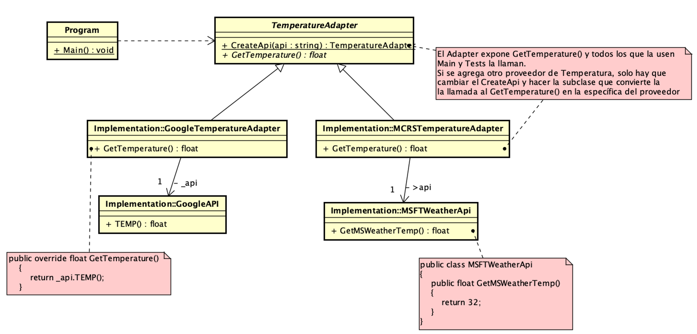

### Adapter Pattern as an example of Protected Variations GRASP pattern
(https://en.wikipedia.org/wiki/GRASP_(object-oriented_design)#Protected_variations)
(https://en.wikipedia.org/wiki/Adapter_pattern)

Diagramas del ejemplo

