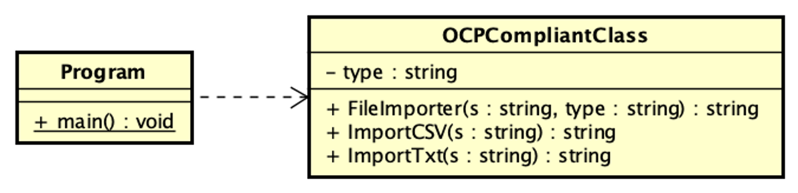
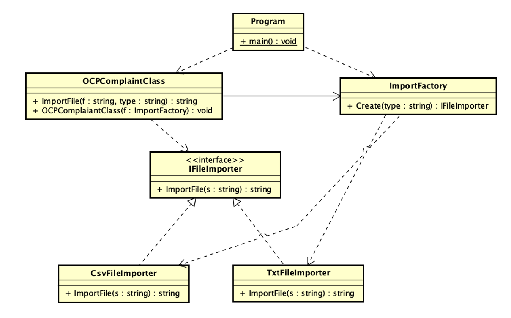

## Ejemplo de clase que cumple con OCP y usa metodo fábrica para crear objectos ##

La clase OCPCompliantClass actua como una clase que necesita importar archvios y actualmente solo importa Txt y Csv.
No cumple con OCP ya que para agregar un nuevo importador se debe modificar la clase.

El diagrama de clase siguiente representa la clase final la cual se puede externder facilmente agregando 
una subclase para importar el nuevo tipo de archivo. La clase OCPCompliantClass utiliza una clase fábrica que sabe crear
el importador adecuado.
Ahora para agregar un nuevo importador se crea una nueva clase que implementa la interfaz IImporter y se modifica la 
fábrica para que la cree.

