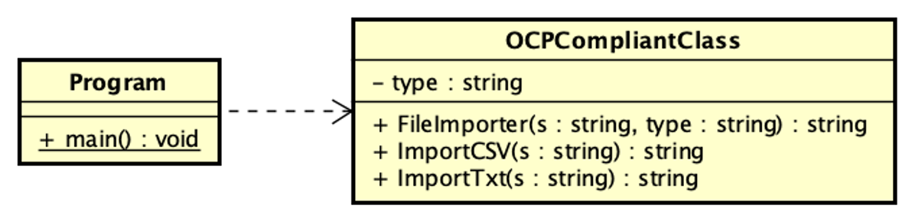
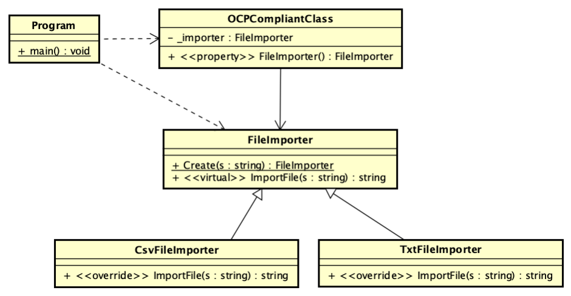

## Ejemplo de clase que cumple con OCP y usa método fábrica para crear objectos ##

La clase program utiliza una clase OCPCompliantClass que necesita importar archvios y actualmente solo importa Txt y Csv.

El diagrama de clase siguiente representa la clase final. Aqui se pued ver que la clase OCPCompliantClass e puede externder 
facilmente sin tocar su código fuente. Solo se necesita crear una subclase de FileImporter que importe el nuevo tipo 
de archivo y agregandolo en el método estatíco Crear(), el cual es un ejemplo de método fábrica.

