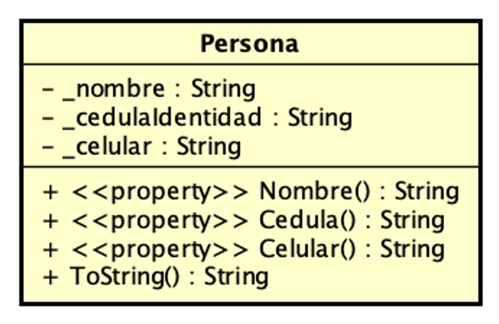
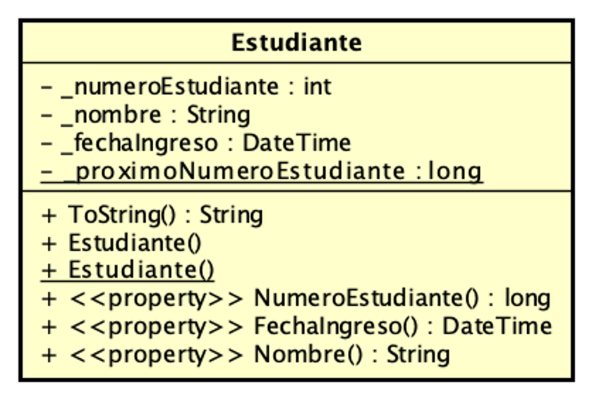
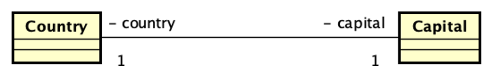
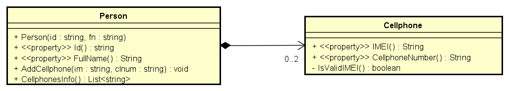

## UML Parte 1 
### Clase ###
El código muestra una clase **Persona** que corresponde con el siguiente diagrama de clases UML. En el código se ejemplifican varias formas de inicializar los objetos constructores y propiedades.



```csharp
public class Persona
{
    private string _nombre = "";
    private string _celular = "";
    private string _cedulaIdentidad = "";

    public Persona()
    {
        // notar el acceso a los atributos directamente, podria haberce usado las properties
        _nombre = "Sin nombre";
        _celular = "Sin celular";
        _cedulaIdentidad = "Sin cedula";
    }

    public Persona(string nombre, string celular, string cedulaIdentidad)
    {
        // notar el acceso a los atributos mediante las properties, podria haberce usado los atributos directamente
        Nombre = nombre;
        Celular = celular;
        CedulaIdentidad = cedulaIdentidad;
    }
    
    //getter y setters, en C# se llaman properties
    public string Nombre
    {
        get => _nombre;
        set => _nombre = value ?? throw new ArgumentNullException(nameof(value));
    }
    
    public string Celular
    {
        get => _celular;
        set => _celular = value ?? throw new ArgumentNullException(nameof(value));
    }
    
    public string CedulaIdentidad
    {
        get => _cedulaIdentidad;
        set => _cedulaIdentidad = value ?? throw new ArgumentNullException(nameof(value));
    }
    
    // cómo hago para evitar el persona1.CedulaIdentidad == persona2.CedulaIdentidad ?
    protected bool Equals(Persona other)
    {
        return _cedulaIdentidad == other._cedulaIdentidad;
    }

    public override bool Equals(object? obj)
    {
        if (obj is null) return false;
        if (ReferenceEquals(this, obj)) return true;
        if (obj.GetType() != GetType()) return false;
        return Equals((Persona)obj);
    }

    public override int GetHashCode()
    {
        return _cedulaIdentidad.GetHashCode();
    }

    public override string ToString()
    {
        return
            $"{nameof(_nombre)}: {_nombre}, {nameof(_celular)}: {_celular}, {nameof(_cedulaIdentidad)}: {_cedulaIdentidad}, {nameof(Nombre)}: {Nombre}, {nameof(Celular)}: {Celular}, {nameof(CedulaIdentidad)}: {CedulaIdentidad}";
    }
}
```

### Clases y relaciones. Implementacion en C# y Diagramas  

En esta solución se encuentran los siguientes proyectos:   

**StaticClient** - muestra como se usan e implementan métodos y atributos **de clase** para una Clase Socio  

**Estudiante** - muestra como se implementan métodos y atributos de instancia y de clase, y propiedades. Tambien muestra la diferencia entre igualdad e identidad.



**BlogEntry** - muestra el uso de propiedades, redefine el método Equals() y ToString()


**BlogEntryReviewRel** - muestra la implementación de asociación direccional (1 a *) entre clases  


**CountryCapital** - muestra un ejemplo de implementación de asociación bi direccional (1 a 1) entre clases



### Proyecto: PersonDevices (Personas y Celulares) ###
En este ejemplo se implementa una relación de composición con navigabilidad y multiplicidad acotada entre Person y Cellphone.



A continuación se muestra el uso de la clase Person que por ser una composición "esconde" a los celulares.

```
using PersonDevices;

var person1 = new Person("5.555.345-1", "Nahuel");
var person2 = new Person("5.123.234-0", "Camila");
try
{
    
    person1.AddCellphone("222-333-1234-44", "+59829021505");
    person2.AddCellphone("123-222-3432-33", "+59829543434");
    person2.AddCellphone("124-422-3432-35", "+5982883345");
    person2.AddCellphone("124-422-3432-35", "+5982883345");
}
catch (Exception ex)
{
    Console.WriteLine(ex.Message);
} 
var camiPhones = person2.CellphonesInfo();
for (int i = 0; i < camiPhones.Count(); i++)
{
    Console.WriteLine($"Cel:{i}, {camiPhones[i]}");
}
```