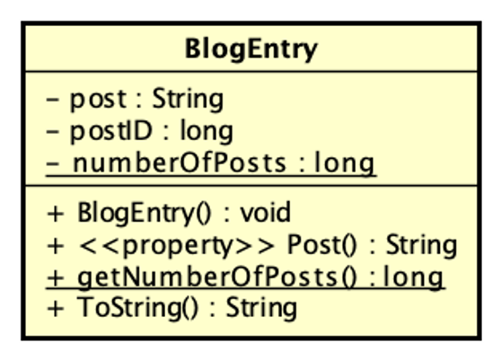
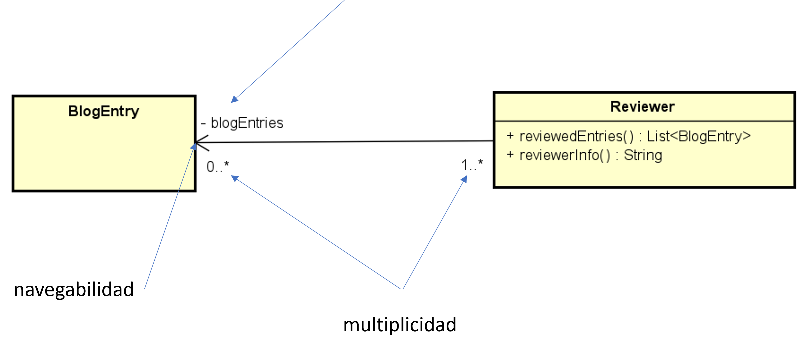

## UML Parte 1 
### Clases y relaciones. Implementacion en C# y Diagramas  

En esta solución se encuentran los siguientes proyectos:   

**StaticClient** - muestra como se usan e implementan métodos y atributos **de clase** para una Clase Socio  

**Estudiante** - muestra como se implementan métodos y atributos de instancia y de clase, y propiedades. Tambien muestra la diferencia entre igualdad e identidad.

**BlogEntry** - muestra el uso de propiedades, redefine el método Equals() y ToString()

**BlogEntryReviewRel** - muestra la implementación de asociación direccional (1 a *) entre clases  

**CountryCapital** - muestra un ejemplo de implementación de asociación bi direccional (1 a 1) entre clases

