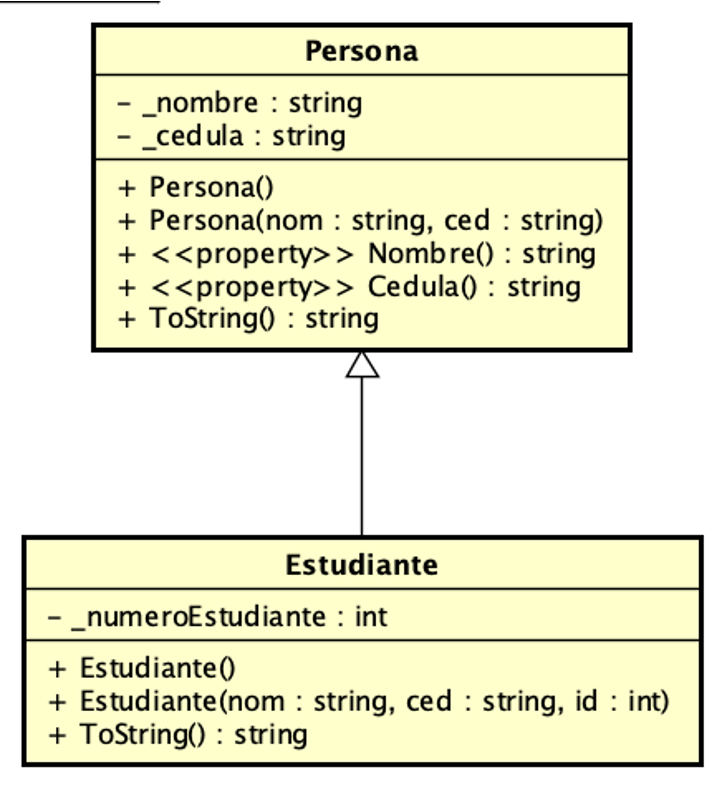
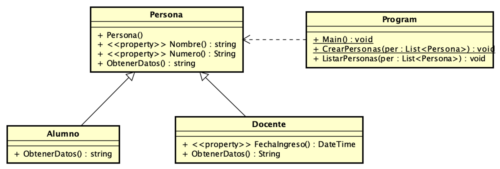
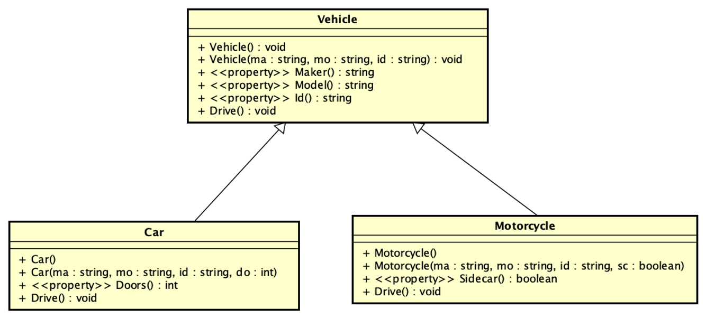
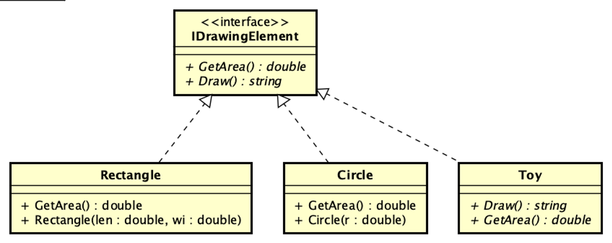
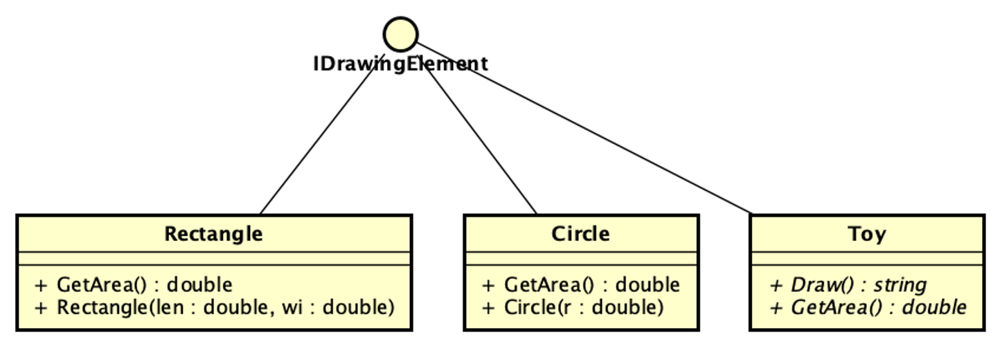

## UML parte 2 - Herencia, polimorfismo e interfaces
### Breve descripción de los siguientes proyectos en la solución:

**Generalización Persona**

Este ejemplo muestra una clase Persona y una clase Estudiante.
En el main se muestran distintos ejemplos de tipos de enlaces (dinámicos y estáticos).

__Tener en cuenta que el código de Program puede no funcionar bien (ver warnings). Hay un problema que es necesario arreglar.
El mismo se dejó con errores para que Ud. demuestre que comprende la herencia.__

[Código fuente](./GeneralizacionPersonaEstudiante)

Diagrama de clases correspondiente:

**RecorrrerPersonasPolimorficamente**

Este ejemplo presenta  que ayudan a comprender al funcionamiento del orden de construcción y el uso de virtual y override
lea el código de main y de las clases Docente, Alumno y Persona.

__Tener en cuenta que el código de Program puede no funcionar bien (ver warnings).
Hay un problema que es necesario arreglar.
El mismo se dejó con errores para que Ud. demuestre que comprende la herencia.__

[Código fuente](./RecorrerPersonasPolimorficamente)

Diagrama de clases correspondiente:

**Vehicles**
Este ejemplo muestra el uso de herencia para representar Vehículos.

__Al igual que los anteriores ejemplos
revise si funciona correctamente listando la información que el main de la clase Program muestra.__

[Código fuente](./Vehicles)

Diagrama de clases correspondiente:

___

## Interfaces vs. Herencia
Los siguientes dos ejemplos muestran el uso de interfaces y polimorfismo.
Es importante notar que en uno de los ejemplos ShapesUsingInheritance no es posible (conceptualmente)
hacer que el Toy herede de la clase Shape. Por eso se utiliza una interfaz en el ejemplo ShapesUsingInterface.

**ShapeUsingInterface**
Este ejemplo muestra la utilización de una interfaz IDrawingElement y cómo las clases Circle, Rectangle y Toy la implementan.
Vea cómo se crean los objetos de cada tipo y cómo se los trata polimórficamente cuando se los
agrega a una lista de IDrawingElement.  __El Toy__ que no es una figura geométrica igual puede ser dibujado.

[Código fuente](./ShapesUsingInterface)

Diagrama de clases correspondiente:

Tener en cuenta que este otro diagrama también muestra la interfaz, pero en formato Lollypop

**ShapeUsingInheritance**
Finalmente, este ejemplo muestra el mismo concepto pero utilizando herencia. Es importante ver que, en este caso, el Toy no se podría agregar a la lista de Shapes.

[Código fuente](./ShapesUsingInheritance)

## Colabore para mejorar ##
Si encuentra algún error, falta ortografica o tiene alguna sugerencia, por favor, hágamelo saber ingresando un issue [Issues](https://github.com/gamousquesORT/DemosDA1/issues).