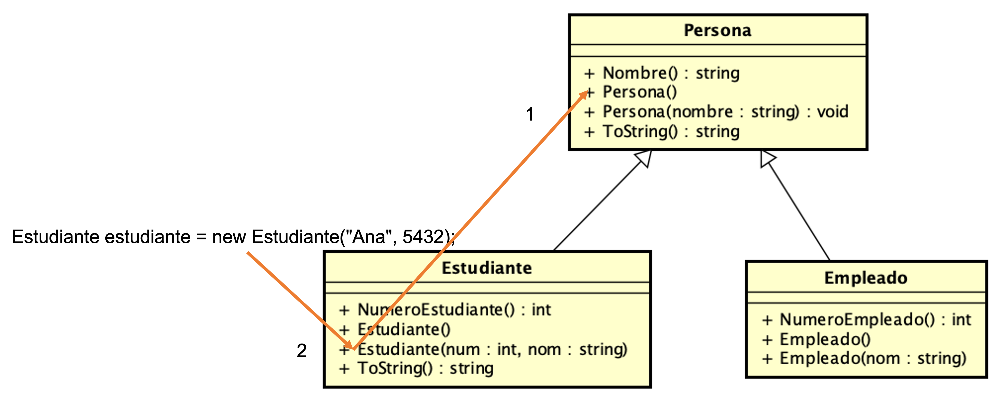

## UML parte 2 - Herencia, polimorfismo e interfaces
### Breve descrpción de los siguientes proyectos en la solución:

**Generalizacion** - Este ejemplo muestra una clase Persona y una clase Estudiante. En el main se muestran distintos tipo de enlaces dinamicos y estáticos.  
[Código fuente](./Generalizacion)  

**Tener en cuenta que el código de Program no compila. Hay un error que es necesario arreglarlo. El mismo, se dejó con errores para que ud. demuestre que comprende la herencia**  


    
Ejercicio asociado: 02.26 Ejercicio 1 _ Herencia basica


```
b)  Para cada bloque (1 a 4) del método mail identifique el método de qué clase se invoca.
  class Program     {
        static void Main(string[] args)        {
            Console.WriteLine("--------(1)-----------\n");
            // El estudiante qué hereda de persona? 
            // que es propio de la clase Estudiante?
            Estudiante alumno = new Estudiante();
            alumno.Nombre = "Gaston";
            alumno.Cedula = "123456778=2";
            alumno.NumeroEstudiante = 159345;
            Console.WriteLine(alumno.ToString() + " \n");
            Console.ReadLine();
            
            Console.WriteLine("--------(2)-----------\n");
            Persona alumnoDos = new Estudiante();
            alumnoDos.Nombre = "Alumno dos";
            alumnoDos.Cedula = "3344558-0";
            alumnoDos.NumeroEstudiante = 159345;
            Console.WriteLine(alumnoDos.ToString() + " \n");            
            Console.ReadLine();
            
           Console.WriteLine("--------(3)-----------\n");
            Estudiante alumnoTres = new Estudiante("Marta", "4.333.221-2", 250345);
            Console.WriteLine(alumnoTres.ToString()+ " \n");
            Console.WriteLine("--------(4)-----------\n");
            // Qué métodos se llaman en este caso?
            String nombre = "una Persona", ci = "4.543.2345-1";
            Persona unaPersona = new Persona(nombre, ci);
            Console.WriteLine(unaPersona.ToString()+ " \n");           
        }
    }
```

___
**Constructores** - Este ejemplo muestra el orden de construcción en una relación de generalización.  
[Código fuente](./Constructores)


Ejercicio asociado: 02.26 Constructores y orden de construcción

```
        // qué pasa si no se llama al constructor de la clase base? cómo queda inicializado el objeto?
        public Empleado(string ci, string nombre, long numeroFunc) 
        : base(ci, nombre)
        {
            _numeroEmpleado = numeroFunc;
        }
```

___

**ImplementacionHerencia 1 y 2** - Este ejemplo presenta varias subclases y en los comentarios se encuentran preguntas que ayudan a comprender al funcionamiento del orden de contrucción y el uso de virtual y override
lea el código de main y de las clases Docente, alumno y persona.


Ejercicio asociado: 02.30 Ejercicio 2 _ Herencia basica

___

## Interfaces
Los siguientes ejemplos muestran el uso de interfaces y polimorfismo.
**Interfaz** - Este ejemplo muestra el uso de una interfaz ICalculator y cómo una clase la implementa.  
[Código fuente](./Interfaz)

**Shape** - Este ejemplo muestra el uso de una interfaz IShape y cómo las clases Circle y Rectangle la implementan. Se le ocurre como podria esvribir el mismo código solo utilizando Generalización?  
[Código fuente](./Shape)